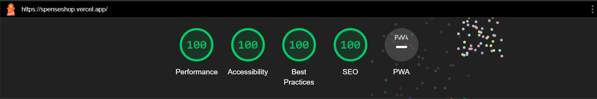

This is a [Next.js](https://nextjs.org/) project that uses [Tailwind Css](https://tailwindcss.com/)

## Getting Started
The project is hosted on [spenseshop.vercel.app](https://spenseshop.vercel.app/)
You can watch the [video demo](https://www.youtube.com/watch?v=RLlpzTLQjUE)

Admin acccess is given to spensetechchallenge@spense.money. Admin panel can be accessed from [https://spenseshop.vercel.app/admin](https://spenseshop.vercel.app/admin)

## Aboute SpenseStore

The whole web app was created using NextJS 13 App Dir and tailwind css. It is blazingly fast with a perfect score from lighthouse.

There is login powered by firebase.

Every checkout details are stored like the following

Admin Panel is very smooth and looks like the following.

## Key Features
 
- Seperate Admin and User Login.
- Admin Panel.
- Fully responsive to all devices.
- Login or view as guest so user can see products without logging in.
- Rewards Based Coins system.
- Cart Functionality.
- Card Discounts Functionality.
- Events can be organised where user gets extra dicounts.
- Local storage so if user comes back, items stay in cart.
- Hover effect in shop items to show all images on hover.
- Products can be viewed in different categories.
- Seperate STORE where all vendors and their products are listed.

